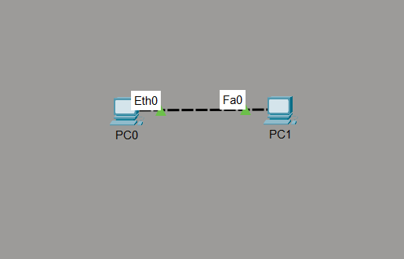
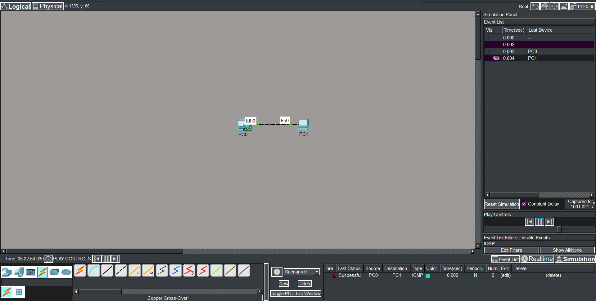

# 🌐 Comunicação entre Dois PCs no Cisco Packet Tracer


Projeto desenvolvido para praticar conceitos fundamentais de redes de computadores utilizando o Cisco Packet Tracer.

O cenário simula uma comunicação direta entre dois computadores utilizando configuração manual de IP e teste de conectividade via ICMP.

---

# 📑 Índice

- [📖 Descrição do Projeto](#-descrição-do-projeto)
- [🖥️ Topologia da Rede](#️-topologia-da-rede)
- [⚙️ Configuração da Rede](#️-configuração-da-rede)
- [🔌 Tipo de Cabo Utilizado](#-tipo-de-cabo-utilizado)
- [📡 Teste de Conectividade](#-teste-de-conectividade)
- [🛠️ Tecnologias Utilizadas](#️-tecnologias-utilizadas)
- [📚 Conceitos Praticados](#-conceitos-praticados)
- [🚀 Aprendizados](#-aprendizados)
- [📁 Estrutura do Projeto](#-estrutura-do-projeto)
- [▶️ Como Abrir o Projeto](#️-como-abrir-o-projeto)
- [👩‍💻 Autora](#-autora)

---

# 📖 Descrição do Projeto

Este projeto foi criado com o objetivo de praticar os primeiros conceitos de redes no Cisco Packet Tracer.

A atividade consiste em:

- conectar dois computadores;
- configurar IP manualmente;
- utilizar o cabo correto;
- validar a comunicação utilizando ICMP.

Esse é meu primeiro projeto utilizando o Packet Tracer durante meus estudos em Redes de Computadores.

---

# 🖥️ Topologia da Rede



---

# ⚙️ Configuração da Rede

## 🖥️ PC0

| Configuração | Valor |
|---|---|
| Endereço IP | 192.168.1.10 |
| Máscara de Rede | 255.255.255.0 |

---

## 🖥️ PC1

| Configuração | Valor |
|---|---|
| Endereço IP | 192.168.1.11 |
| Máscara de Rede | 255.255.255.0 |

---

# 🔌 Tipo de Cabo Utilizado

Foi utilizado o cabo:

```text
Copper Cross-Over
```

O cabo crossover é utilizado para comunicação direta entre dispositivos do mesmo tipo, como:

- PC ↔ PC
- Switch ↔ Switch
- Router ↔ Router

---

# 📡 Teste de Conectividade

O teste foi realizado utilizando o protocolo ICMP no modo *Simulation* do Cisco Packet Tracer.

Resultado do teste:

✅ Comunicação realizada com sucesso entre os dispositivos.



---

# 🛠️ Tecnologias Utilizadas

- Cisco Packet Tracer
- IPv4
- ICMP
- Ethernet
- Simulação de Redes

---

# 📚 Conceitos Praticados

- Comunicação entre hosts
- Configuração manual de IP
- Máscara de rede
- Uso de cabo crossover
- Teste de conectividade
- Simulation Mode
- ICMP/Ping


---

# ▶️ Como Abrir o Projeto

## Pré-requisitos

- Cisco Packet Tracer instalado

## Passos

```bash
# Clone este repositório
git clone https://github.com/SEU-USUARIO/packet-tracer-primeira-rede
```

Depois:

- abra o arquivo `.pkt`;
- execute o Packet Tracer;
- entre no modo *Simulation*;
- visualize o teste ICMP.

---

# 👩‍💻 Autora

Projeto desenvolvido por Nicolle durante os estudos em Redes de Computadores.


🔗 GitHub:
[nicolle-assis](https://github.com/nicolle-assis)
